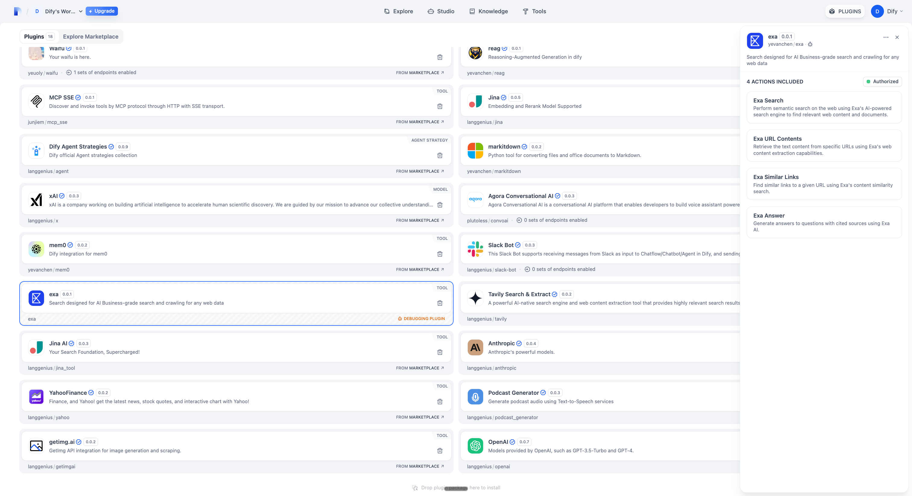

## exa

**Author:** yevanchen
**Version:** 0.0.1
**Type:** tool

### Contact
For questions or support, contact: evanchen@dify.ai

### Description

Exa is an AI-powered search tool that enables semantic search, content retrieval, similarity search, and answers generation using Exa's advanced API.

## Tools

### 1. Exa Search (`exa_search`)

The search endpoint lets you intelligently search the web and extract contents from the results.

By default, it automatically chooses between traditional keyword search and Exa's embeddings-based model to find the most relevant results for your query.

#### Parameters:

- **query** (string, required): The search query to find relevant information on the web.
- **search_type** (select, optional, default: "neural"): 
  - Options: "neural" (semantic), "keyword" (traditional), "auto"
  - Neural uses advanced AI for semantic understanding, keyword uses traditional search techniques
- **num_results** (number, optional, default: 10): Maximum number of search results (1-100)
- **include_domains** (string, optional): Comma-separated list of domains to include in results
- **exclude_domains** (string, optional): Comma-separated list of domains to exclude from results
- **start_published_date** (string, optional): Only include results published after this date (YYYY-MM-DD)
- **end_published_date** (string, optional): Only include results published before this date (YYYY-MM-DD)
- **use_autoprompt** (boolean, optional, default: true): Whether to use Exa's prompt engineering to improve the query
- **text_contents** (boolean, optional, default: false): Whether to include text contents from each result
- **highlight_results** (boolean, optional, default: false): Whether to highlight relevant snippets
- **category** (select, optional): Focus on specific data categories
  - Options: "company", "research paper", "news", "pdf", "github", "tweet", "personal site", "linkedin profile", "financial report"
- **includeText** (string, optional): Text that must be present in results (up to 5 words)
- **excludeText** (string, optional): Text that must not be present in results (up to 5 words)

### 2. Exa Answer (`exa_answer`)

Get an LLM answer to a question informed by Exa search results. Fully compatible with OpenAI's chat completions endpoint.

/answer performs an Exa search and uses an LLM (GPT-4o-mini) to generate either:
- A direct answer for specific queries (i.e., "What is the capital of France?" would return "Paris")
- A detailed summary with citations for open-ended queries (i.e., "What is the state of AI in healthcare?" would return a summary with citations to relevant sources)

#### Parameters:

- **query** (string, required): The question to be answered with supporting evidence from the web
- **text** (boolean, optional, default: false): Include the full text content of each source in the results
- **model** (select, optional, default: "exa"):
  - Options: "exa", "exa-pro"
  - Specify which model should process the query and generate the answer

### 3. Exa Similar Links (`exa_similar`)

Find similar links to the link provided and optionally return the contents of the pages.

#### Parameters:

- **url** (string, required): The source URL to find similar content for
- **num_results** (number, optional, default: 10): Number of similar links to return (max 100)
- **text** (boolean, optional, default: false): Include the full text content of each similar page

### 4. Exa URL Contents (`exa_contents`)

Get the full page contents, summaries, and metadata for a list of URLs.

Returns instant results from Exa's cache, with automatic live crawling as fallback for uncached pages.

#### Parameters:

- **urls** (string, required): Comma-separated list of URLs to extract content from
- **livecrawl** (select, optional, default: "never"):
  - Options: "never", "fallback", "always", "auto"
  - Choose the live crawling strategy for content retrieval
- **full_page_text** (boolean, optional, default: false): Include the full text of each webpage, including subpages
- **ai_page_summary** (boolean, optional, default: false): Generate a summary for each webpage using LLM
- **number_of_subpages** (number, optional, default: 1): Number of subpages to include in content extraction
- **return_links** (number, optional, default: 1): Number of links to return from each webpage

## Acknowledgements

Special thanks to [@ExaAILabs](https://x.com/ExaAILabs) for providing the powerful API that powers this plugin.

